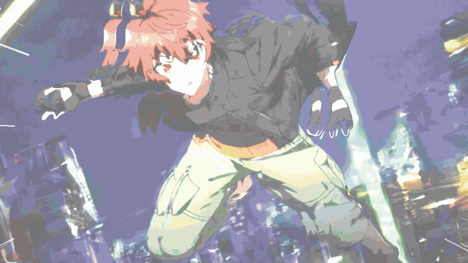
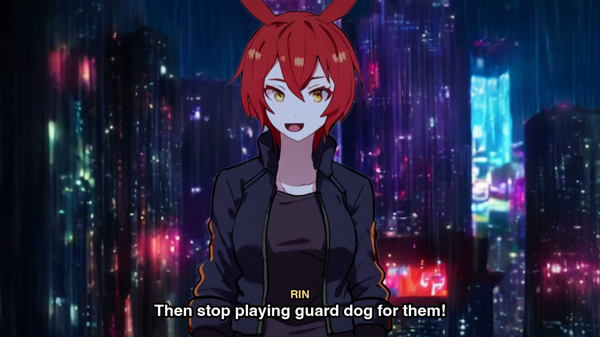
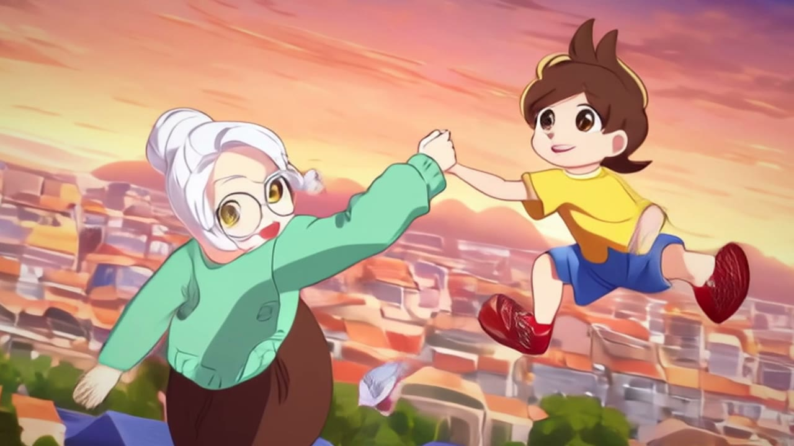
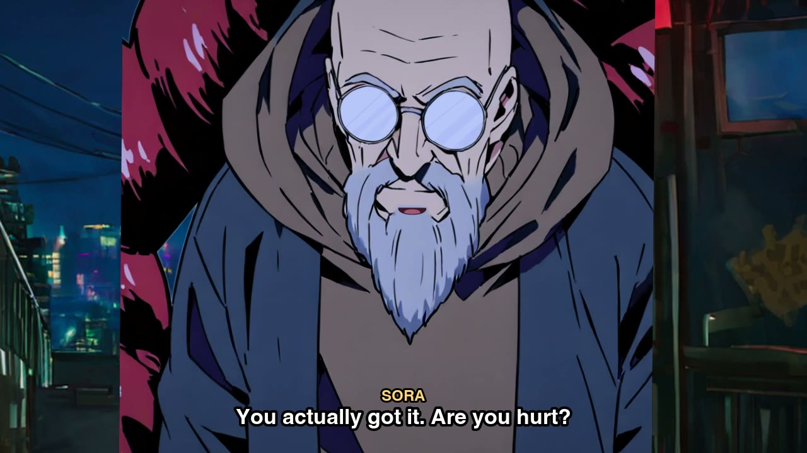
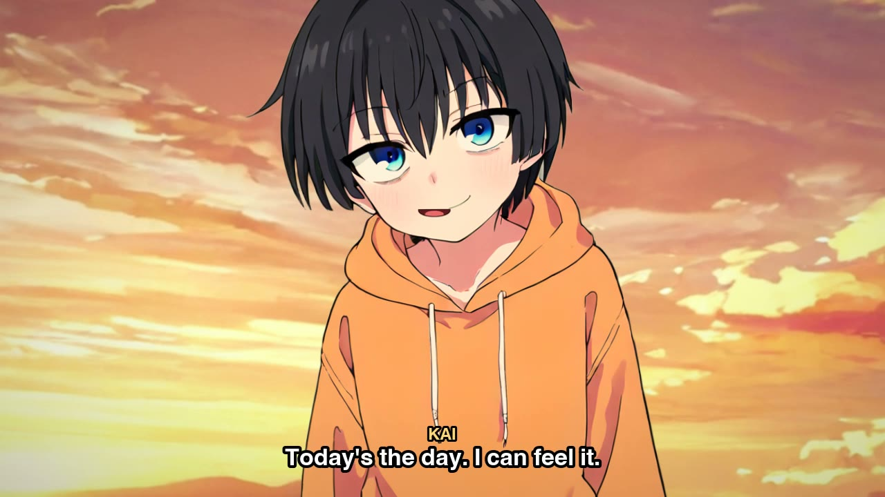
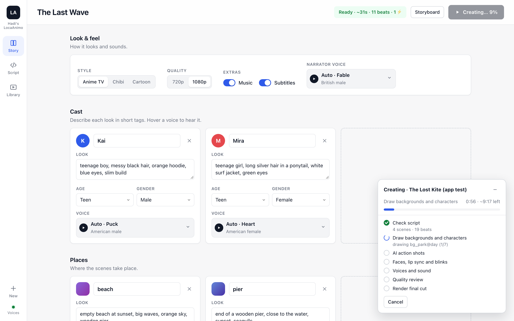
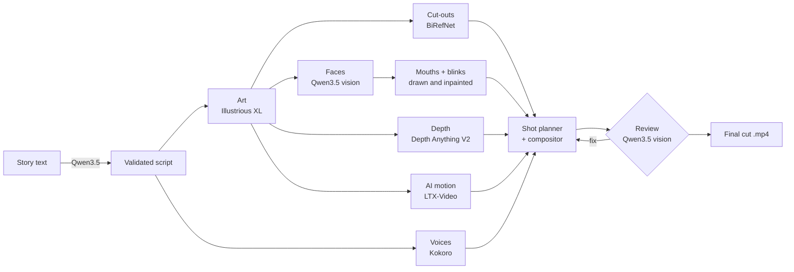

<div align="center">

# Hadi's LocaAnimo

### Write the story. Your Mac makes the episode.

<sub>Created by <b>Abdul Hadi Adnan</b> · open source</sub>

**A fully voiced, animated cartoon episode from a written script. 100% local: no cloud, no API keys, no subscriptions.**

[](#requirements)
[](#quick-start)
[](#how-it-works)
[](#the-models)
[](LICENSE)

<a href="docs/media/showcase.mp4"></a>

<sub>▶ <a href="docs/media/showcase.mp4">Watch the 40-second showcase with sound</a> · made entirely from LocaAnimo's own output</sub>

</div>

---

## What it does

You write a story, as a screenplay, a short story or rough notes. LocaAnimo turns it into a finished episode on your Mac:

- 🎨 **Draws every background, character and action moment** in a consistent anime or cartoon style
- 🗣️ **Gives each character their own voice**, with lip sync and blinking
- 🎥 **Directs it**: camera moves, 2.5D depth parallax, shot framing on whoever is speaking, cuts on the beat of the scene
- ⚡ **Animates the big moments with real AI motion** (LTX-Video), starting from the drawn keyframe
- 🔊 **Adds sound**: ambience per location, sound effects and subtitles
- 👀 **Reviews its own work** with a local vision model before the final cut, and fixes what looks wrong

<table>
<tr>
<td></td>
<td></td>
</tr>
<tr>
<td align="center"><sub><b>Ember Protocol</b>: a 78-second, 4-scene neon chase</sub></td>
<td align="center"><sub><b>The Lost Kite</b>: AI motion (LTX-Video) from a drawn keyframe</sub></td>
</tr>
<tr>
<td></td>
<td></td>
</tr>
<tr>
<td align="center"><sub>Lip sync works through beards, glasses and scars</sub></td>
<td align="center"><sub><b>The Last Wave</b>: the very first test episode</sub></td>
</tr>
</table>

## Quick start

```sh
git clone <this repo> && cd <this repo>
scripts/setup.sh            # Python env + core models (~11 GB)
scripts/setup.sh --video    # optional: + LTX-Video for AI action shots (~27 GB)
./studio.sh                 # opens the studio at http://127.0.0.1:4747
```

In the studio, paste your story into **Script → Plain text** and press **Fill in fields**. The local model turns it into characters, places and scenes. Pick voices (hover to hear them), then press **Create episode**. Finished episodes land in the **Library** and in `outputs/`.

Prefer the terminal?

```sh
scripts/make_episode.sh examples/the_lost_kite.yaml kite    # → outputs/the-lost-kite-<time>.mp4
```

<p align="center"></p>

## Writing a script

Any format works in the studio's plain-text box. The more you describe, the less it has to guess:

```text
Title: The Lost Kite
Leo is a little boy with curly brown hair, a yellow t-shirt and red sneakers.
Grandma Rose has white hair in a bun, round glasses and a green cardigan.

Scene 1: A sunny city park. Happy.
Narrator: Leo had built his very first kite.
LEO (happy): Look, Grandma! It's flying!
BIG MOMENT: A gust snaps the string and the kite shoots up into the sky.
```

Under the hood every episode is a validated YAML script (see [`examples/`](examples/)). Use that directly for full control over emotions, gestures, camera shots, sound effects and pauses:

```yaml
- line: { who: kaito, text: "Not today. Stay behind me!", emotion: confident }
- action: "Kaito throws himself in front of Rin as a drone fires a blinding blast"
  characters: [kaito, rin]
  big: true          # ← animated with real AI motion
```

## How it works



1. **Script.** Free text is converted by the local Qwen3.5 model, and every id, emotion and camera move is validated before anything heavy runs.
2. **Art.** Illustrious XL draws one plate per location and time of day, one model sheet per character and one keyframe per big moment. Seeds are fixed, so re-runs are reproducible, and finished art is cached.
3. **Puppets.** BiRefNet cuts each character out. Qwen3.5's vision finds the eyes and mouth (twice, the second time zoomed in), then mouths are drawn in TV-anime style and blinks are inpainted in the character's own style.
4. **Motion.** Every beat becomes a shot: depth-parallax camera moves, framing on the speaker, characters breathing, swaying, walking in and lip-flapping on twos, the way TV anime is timed. `big: true` beats become real AI motion with LTX-Video.
5. **Review.** Before the final cut, the vision model inspects every open mouth, every blink, the AI clips and one preview frame per shot. Anything clearly wrong gets fixed automatically: a different mouth method, blinks dropped, or a clip swapped for the still.
6. **Sound.** Kokoro voices (auto-cast by age and gender), ambience by location, effects and subtitles are mixed and encoded with the Mac's hardware encoder.

Heavy models never share memory. Each runs in its own process and exits before the next one starts, which is how it all fits on an 18 GB MacBook.

## The models

| Role | Model | Size | License |
|---|---|---|---|
| Art | [Illustrious XL v2.0](https://huggingface.co/OnomaAIResearch/Illustrious-XL-v2.0) (SDXL) | 6.9 GB | Fair AI Public License 1.0-SD |
| Voices | [Kokoro-82M](https://huggingface.co/hexgrad/Kokoro-82M) | 0.3 GB | Apache-2.0 |
| Script import · faces · review | [Qwen3.5-4B](https://huggingface.co/mlx-community/Qwen3.5-4B-4bit) (MLX 4-bit) | 2.9 GB | Apache-2.0 |
| Cut-outs | [BiRefNet](https://huggingface.co/ZhengPeng7/BiRefNet) | 0.9 GB | MIT |
| Depth | [Depth Anything V2 Small](https://huggingface.co/depth-anything/Depth-Anything-V2-Small) | 0.1 GB | Apache-2.0 |
| AI motion *(optional)* | [LTX-Video 2B distilled](https://huggingface.co/Lightricks/LTX-Video) + T5 | 25 GB | see repo |
| Face fallback | [lbpcascade_animeface](https://github.com/nagadomi/lbpcascade_animeface) | <1 MB | MIT |

`scripts/download_models.py --list` shows exactly what gets downloaded. Check each model's license before using episodes commercially.

## Performance

Measured on a **MacBook Pro M3 Pro (18 GB)**:

| Step | Time |
|---|---|
| One drawn image (1344×768 or 832×1216) | 70–160 s |
| One AI motion clip (2.7 s at 768×448) | 41–52 s |
| Face finding + review (whole episode) | ~1.5 min |
| Compositing + encoding (1 min of video) | ~40 s |
| **The Lost Kite** (57 s, 4 scenes, 2 AI shots), from script to final cut | **~19 min** |

Drawing the art takes most of the time. It's cached, so changing dialogue or voices and re-rendering takes about 4 minutes.

## Requirements

- macOS on Apple Silicon (built and tested on an M3 Pro with 18 GB; 16 GB is the practical minimum)
- [ffmpeg](https://ffmpeg.org) on your `PATH`
- ~15 GB disk for the core models, ~40 GB with AI motion

## Project layout

```
studio.sh                  start the studio app
scripts/
  setup.sh                 environment + models
  download_models.py       model downloader (--list, --video)
  make_episode.sh          script → episode from the terminal
  make_art.py              step 1: draw all art (cached)
  render_episode.py        step 2: faces, AI clips, review, voices, final cut
  dev/                     experiments and the showcase-video builder
src/locaanimo/
  schema.py                the script format (validated with Pydantic)
  art.py                   Illustrious prompts, drawing, inpainting
  prep.py                  cut-outs, faces, mouths, blinks, depth
  landmarks.py             Qwen3.5 vision: where are the eyes and mouth?
  animate.py               shot planner + compositor
  video.py                 LTX-Video action clips
  review.py                Qwen3.5 vision quality review
  voices.py                Kokoro voices, casting, previews
  importer.py              free text → script (Qwen3.5)
  server.py, pipeline.py   the studio app's backend and job runner
web/                       the studio app (no build step, no framework)
examples/                  ready-to-run episode scripts
docs/                      design notes and media
```

## Honest limitations

- **Bodies don't move limbs yet.** Characters are expressive puppets (breathing, swaying, walking in, lip sync, blinks), not fully rigged. AI motion covers the big moments.
- **AI clips are short and soft.** They run 2.7 s at 768×448 and can morph small objects.
- **The review step catches clear mistakes, not subtle ones.** A 4B vision model reliably spots a misplaced mouth or a winking blink, but not slight smears.
- **Art direction is prompt-based.** Props mentioned in the story, like the kite, don't always make it into the picture yet.

## Roadmap

- [ ] Rigged limbs and gestures (pointing, waving) from the script's `gesture` tags
- [ ] Props as their own layer, so story objects always appear
- [ ] Per-image and per-clip **Regenerate** in the studio
- [ ] Music scoring with [ACE-Step](https://github.com/ace-step/ACE-Step-1.5)
- [ ] NVIDIA support (Wan 2.2, Index-AniSora) for full-motion episodes

## Credits

**Hadi's LocaAnimo** is an open-source project by **Abdul Hadi Adnan**.

Built on the work of the teams behind Illustrious XL, LTX-Video (Lightricks), Qwen (Alibaba), Kokoro (hexgrad), BiRefNet, Depth Anything (code vendored under Apache-2.0 in `src/locaanimo/third_party/`), lbpcascade_animeface (nagadomi), diffusers, transformers, MLX and ffmpeg.

## License

The code is [MIT](LICENSE). The model weights each keep their own license (see [The models](#the-models)), and Depth Anything's vendored code is Apache-2.0.
